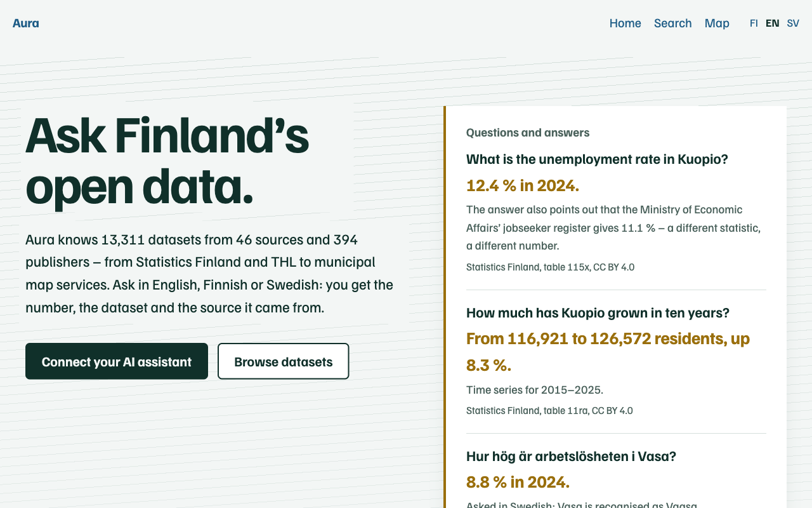
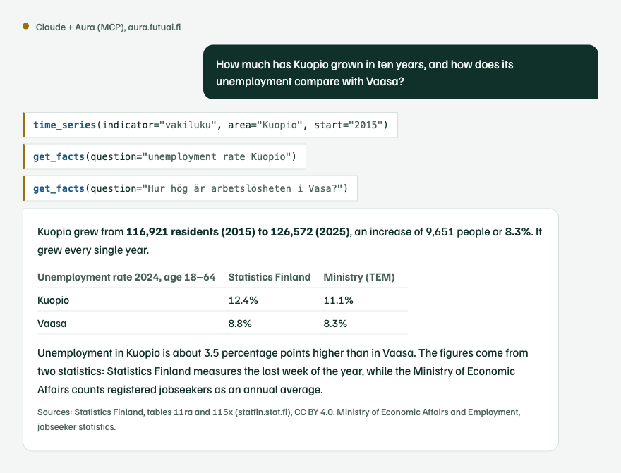
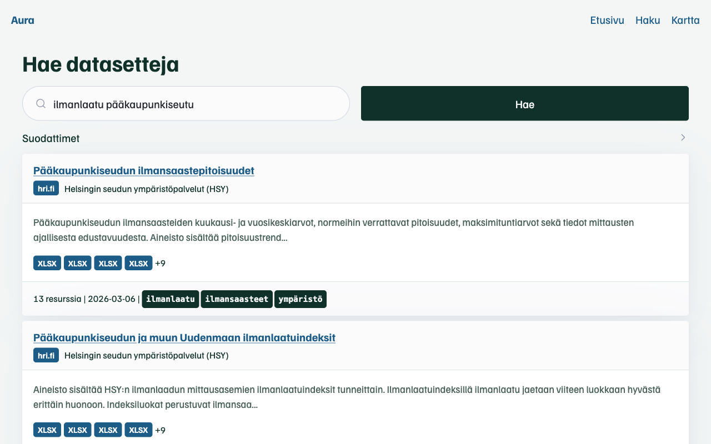

# Aura

**Ask Finland’s open data.** Aura indexes Finland’s open data in a single catalogue and fetches answers straight from the publisher’s API, with source and licence attached. Use it in the browser or connect it to your AI assistant.

[Suomi](README.md) | **English** | [Svenska](README.sv.md)



> **13,300+ datasets, 32,000+ resources, 46 sources, about 400 publishers.**
> Statistics Finland, the Finnish Institute for Health and Welfare (THL), the Natural Resources Institute (Luke), the Finnish Environment Institute (SYKE), the Finnish Meteorological Institute, Digitraffic, the National Land Survey, Parliament, Finlex, the business register (PRH), map services of 36 municipalities and dozens more.

## Try it in a minute

The public service at **[aura.futuai.fi](https://aura.futuai.fi)** needs no account and no installation. In Claude Code:

```bash
claude mcp add --transport http aura https://aura.futuai.fi/mcp
```

In Claude Desktop, Cursor and other MCP clients:

```json
{
  "mcpServers": {
    "aura": { "type": "http", "url": "https://aura.futuai.fi/mcp" }
  }
}
```

Then ask your assistant in English, Finnish or Swedish. Client-specific instructions are in the [setup guide](docs/MCP_SETUP.md) (in Finnish).

## What you can ask

The answers below were retrieved from Aura on 8 October 2026. Numbers are exactly as published by the source.

| Question | Aura answers | Source |
|---|---|---|
| What is the unemployment rate in Kuopio? | 12.4% in 2024, plus a note that the Ministry of Economic Affairs’ jobseeker register gives 11.1% because it measures something different. | Statistics Finland 115x |
| How much has Kuopio grown in ten years? | 116,921 → 126,572 residents (2015–2025), +8.3% | Statistics Finland 11ra |
| Hur hög är arbetslösheten i Vasa? | 8.8% in 2024. Vasa is recognised as Vaasa. | Statistics Finland 115x |
| The six largest cities by population | Helsinki 694,392, Espoo 325,716, Tampere 263,337, Vantaa 252,956, Oulu 217,469, Turku 209,633 (2025) | Statistics Finland 11ra |
| air quality Helsinki | The Meteorological Institute’s ENFUSER air quality forecast and hourly air quality indices from the Helsinki Region Environmental Services | FMI, HRI |
| Which statistic covers animal welfare offences? | Table 126q on animal-keeping bans. The term is not in the title; it is one of the table’s classification values. ¹ | Statistics Finland |
| When does train IC147 arrive in Kuopio today? | The agent finds Digitraffic’s rail API and fetches the live timetable. | Digitraffic |

¹ Search inside the data is available in [Aura Pro](#aura-pro).

This is what it looks like in Claude. The assistant makes three calls and explains where the numbers come from and why two statistics disagree:



## For AI agents

Aura is designed for agents, not just for browsing.

The public profile has five intent-level tools, and the agent works with them the way a research librarian would: `find_data` searches, `inspect_dataset` explains what a dataset contains, and `query_source` fetches the rows from the source. `area_snapshot` resolves an area and `find_related` finds similar datasets.

Every response is structured and follows a published `outputSchema`, so the agent never parses free text. Numbers come with the source, the exact query URL, the licence and the retrieval time (`provenance`). Responses suggest the next calls (`next_actions`), and errors carry a code, a hint and a corrected call (`error.hint`, `error.suggested_call`).

Areas can be given in many forms: `Tampere`, `Tammerfors`, `837`, `KU837`, `Pirkanmaa`, `33100`, even inflected Finnish (`Tampereella`). An abolished municipality resolves to its successor (`Nastola` → Lahti).

`query_source` handles PxWeb, WFS, the Meteorological Institute’s stored queries, OData, CSV and JSON. In PxWeb, time accepts `uusin` (latest) and ranges like `2020-2024`.

The instructions are under 1,500 characters, so Aura does not eat the agent’s context. A machine-readable description lives at [`/llms.txt`](https://aura.futuai.fi/llms.txt).

## For people

The same catalogue is available in the browser: search with filters, dataset pages with resources, previews of tables and map layers, and a map of datasets by area. The browsing pages are in Finnish; the [landing page](https://aura.futuai.fi/en) is also in English and Swedish.



Aura also serves data publishers. The quality profile (`/mcp/laatu`) tells a publisher which of their datasets lack a description, keywords, update frequency or licence, and which links are broken.

## Where the data comes from


Aura harvests metadata, not the data itself. Each source has its own harvester (CKAN, PxWeb, WFS, OData, OpenAPI, GTFS or the source’s own API). The catalogue is a SQLite database whose Finnish search understands inflections and compound words. When the agent needs rows, `query_source` fetches them straight from the publisher, so the numbers are always as fresh as the source.

| Theme | Sources |
|---|---|
| Statistics | Statistics Finland (StatFin and spatial data), THL Sotkanet, Luke, Vipunen (education), Kelasto (social security), Traficom statistics, State Treasury, public libraries |
| Environment and nature | SYKE, Finnish Forest Centre, Luke, Geological Survey, Finnish Biodiversity Information Facility, Radiation and Nuclear Safety Authority, SMEAR |
| Weather and transport | Meteorological Institute, Digitraffic, Digitransit, Finap, Traficom, Finavia, Transport Infrastructure Agency |
| Spatial data | National Land Survey, Paikkatietoikkuna, Paituli, Overture Maps, Lipas, background maps, 36 municipal map services |
| Society | Parliament, Finlex, election results, campaign finance, party programmes, business register, public service register |
| Catalogues | avoindata.fi, Helsinki Region Infoshare, Suomi.fi code lists and terminologies |

Full lists: [dataset catalogue](docs/CATALOG.md) and [source details](docs/SOURCES.md) (in Finnish).

## Aura Pro

[aura.futuai.fi](https://aura.futuai.fi) runs an extended version of Aura. You connect it the same way as the open version, and it adds:

- Ready-made indicators: more than 200 indicators for municipalities, regions and wellbeing services counties in a single call, such as population, unemployment rate, housing prices and the morbidity index. Tools `get_facts`, `time_series` and `compare_areas`.
- Search inside the data: the index includes statistical classification values, column names of spatial datasets and code list concepts, so a term is found even when no title contains it.
- Ask in any language: vector search connects English and Swedish questions to the Finnish-language catalogue.
- Honest numbers: when two statistics measure the same thing differently, the answer gives both and explains why.

The service is operated by Futuai Oy. The Pro layer’s code is not in this repository. Everything in this repository is MIT licensed and works on its own.

## Run it yourself

The database ships with the repository ([Git LFS](https://git-lfs.github.com/)), so the datasets are there right after cloning.

```bash
git clone https://github.com/trotor/aura.git
cd aura
python3 -m venv .venv && source .venv/bin/activate
pip install -e .

claude              # Claude Code starts Aura from the repo's .mcp.json
aura serve --http   # or MCP + web at http://127.0.0.1:8000
```

Your own instance is the full version: the database is writable and every tool, including harvesting and enrichment, is available. Other clients, the CLI, tool profiles and boundary datasets are covered in the [technical reference](docs/REFERENCE.md) (in Finnish).

## Contribute

- Enrich datasets: when an agent studies a dataset, it can save what it learned (`enrich`, `save_session_findings`). Enrichments are shared as pull requests.
- Add a source: a new harvester is usually one file. See [CONTRIBUTING.md](CONTRIBUTING.md).
- Tell us what is missing: [open an issue](https://github.com/trotor/aura/issues).

## More

[Technical reference](docs/REFERENCE.md) | [Setup](docs/MCP_SETUP.md) | [Dataset catalogue](docs/CATALOG.md) | [Sources](docs/SOURCES.md) | [Formats](docs/formats.md) | [What’s new](docs/WHATSNEW.md) | [Changelog](CHANGELOG.md)

*Aura* is Finnish for a plough, which turns over what lies hidden under the surface. It is also a halo of light that makes visible what would otherwise stay in the dark.

## Licence

[MIT](LICENSE). Dataset licences belong to their publishers, and Aura reports them with every answer.
