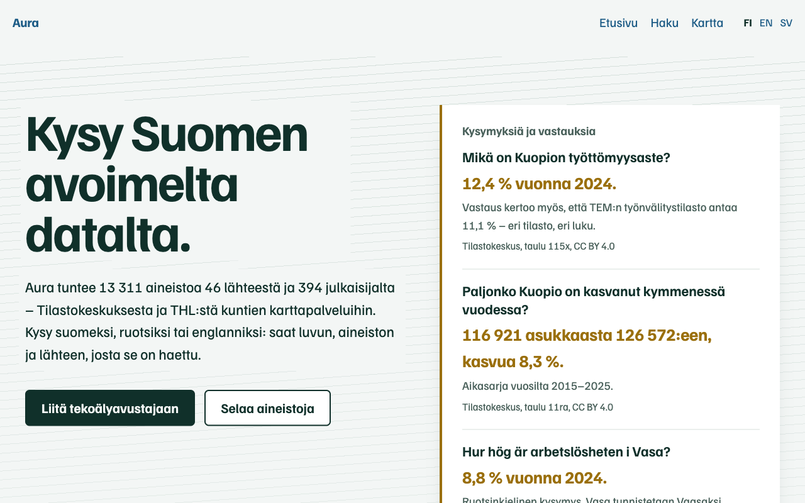
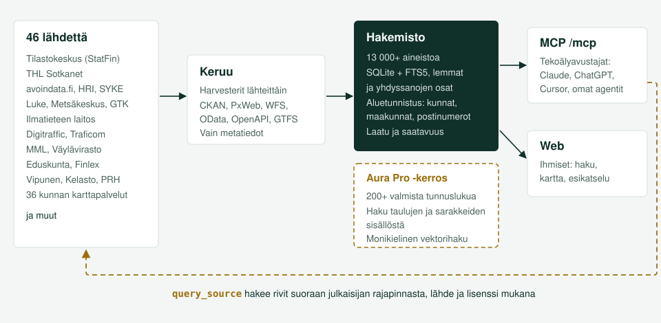

# Aura

**Kysy Suomen avoimelta datalta.** Aura kokoaa Suomen avoimen datan yhteen hakemistoon ja hakee vastaukset suoraan julkaisijan rajapinnasta, lähde ja lisenssi mukana. Käytä sitä selaimella tai liitä se tekoälyavustajaasi.

**Suomi** | [English](README.en.md) | [Svenska](README.sv.md)



> **13 300+ aineistoa, 32 000+ resurssia, 46 lähdettä, noin 400 julkaisijaa.**
> Tilastokeskus, THL, Luke, SYKE, Ilmatieteen laitos, Digitraffic, MML, Väylävirasto, eduskunta, Finlex, Vipunen, Kelasto, PRH, 36 kunnan karttapalvelut ja kymmenet muut.

## Kokeile minuutissa

Julkinen palvelu osoitteessa **[aura.futuai.fi](https://aura.futuai.fi)** ei vaadi tunnuksia eikä asennusta. Claude Codessa:

```bash
claude mcp add --transport http aura https://aura.futuai.fi/mcp
```

Claude Desktopissa, Cursorissa ja muissa MCP-asiakkaissa:

```json
{
  "mcpServers": {
    "aura": { "type": "http", "url": "https://aura.futuai.fi/mcp" }
  }
}
```

Kysy sitten avustajalta suomeksi, ruotsiksi tai englanniksi. Asiakaskohtaiset ohjeet ovat [käyttöönotto-ohjeessa](docs/MCP_SETUP.md).

## Mitä voit kysyä

Alla olevat vastaukset on haettu Aurasta 8.10.2026. Luvut ovat sellaisenaan lähteestä.

| Kysymys | Aura vastaa | Lähde |
|---|---|---|
| Mikä on Kuopion työttömyysaste? | 12,4 % vuonna 2024. Lisäksi huomautus, että TEM:n työnvälitystilasto antaa 11,1 %, koska se mittaa eri asiaa. | Tilastokeskus 115x |
| Paljonko Kuopio on kasvanut kymmenessä vuodessa? | 116 921 → 126 572 asukasta (2015–2025), +8,3 % | Tilastokeskus 11ra |
| Hur hög är arbetslösheten i Vasa? | 8,8 % vuonna 2024. Vasa tunnistetaan Vaasaksi. | Tilastokeskus 115x |
| Kuusi suurinta kaupunkia väkiluvun mukaan | Helsinki 694 392, Espoo 325 716, Tampere 263 337, Vantaa 252 956, Oulu 217 469, Turku 209 633 (2025) | Tilastokeskus 11ra |
| air quality Helsinki | Ilmatieteen laitoksen ENFUSER-ilmanlaatuennuste ja HSY:n tunneittaiset ilmanlaatuindeksit | FMI, HRI |
| Missä tilastossa ovat eläinsuojelurikoksista tuomitut? | Taulu 126q, eläintenpitokiellot. Sana ei ole otsikossa, vaan taulun luokitusarvoissa. ¹ | Tilastokeskus |
| Moneltako IC147 saapuu Kuopioon tänään? | Agentti löytää Digitrafficin rata-API:n ja hakee aikataulun reaaliajassa. | Digitraffic |

¹ Haku aineistojen sisältä toimii [Aura Prossa](#aura-pro).

Tältä se näyttää Claudessa. Avustaja tekee kolme kutsua ja kertoo, mistä luvut tulevat ja miksi kaksi tilastoa antaa eri tuloksen:


## Tekoälyagentille

Aura on tehty agentin käyttöön, ei vain selattavaksi.

Julkisessa profiilissa on viisi aikomustason työkalua, ja agentti etenee niillä kuten tietopalvelun ammattilainen: `find_data` etsii, `inspect_dataset` kertoo mitä aineistossa on, ja `query_source` hakee rivit lähteestä. Lisäksi `area_snapshot` tunnistaa alueen ja `find_related` etsii samankaltaisia aineistoja.

Jokainen vastaus on strukturoitu ja noudattaa julkaistua `outputSchema`a, joten agentin ei tarvitse jäsentää vapaata tekstiä. Lukujen mukana tulevat lähde, kyselyn täsmällinen URL, lisenssi ja hakuaika (`provenance`). Vastaus ehdottaa seuraavia kutsuja (`next_actions`), ja virheessä on koodi, vihje ja korjattu kutsu (`error.hint`, `error.suggested_call`).

Alueen voi antaa monella tavalla: `Tampere`, `Tampereella`, `Tammerfors`, `837`, `KU837`, `Pirkanmaa`, `33100`. Lakkautettu kunta tulkitaan seuraajakseen (`Nastola` → Lahti).

`query_source` osaa PxWebin, WFS:n, Ilmatieteen laitoksen tallennetut kyselyt, ODatan, CSV:n ja JSONin. PxWebissä aika ymmärtää arvot `uusin` ja `2020-2024`.

Ohjeteksti on alle 1 500 merkkiä, joten Aura ei syö agentin kontekstia. Koneluettava kuvaus palvelusta on osoitteessa [`/llms.txt`](https://aura.futuai.fi/llms.txt).

## Ihmiselle

Selaimella näkee saman hakemiston: haku suodattimineen, aineistosivut resursseineen, taulukoiden ja karttatasojen esikatselu sekä kartta aineistojen alueellisesta jakaumasta.


Aura palvelee myös julkaisijaa. Laatuprofiili (`/mcp/laatu`) kertoo julkaisijan omista aineistoista, mistä puuttuu kuvaus, avainsanat, päivitystiheys tai lisenssi ja mitkä linkit eivät toimi.

## Mistä data tulee



Aura kerää lähteistä metatiedot, ei itse dataa. Jokaiselle lähteelle on oma keräin (CKAN, PxWeb, WFS, OData, OpenAPI, GTFS tai lähteen oma rajapinta). Hakemisto on SQLite-kanta, jossa suomen kielen haku ymmärtää taivutusmuodot ja yhdyssanojen osat. Kun agentti tarvitsee rivejä, `query_source` hakee ne suoraan julkaisijalta, joten luvut ovat aina lähteen tuoreimpia.

| Teema | Lähteitä |
|---|---|
| Tilastot | Tilastokeskus (StatFin ja paikkatiedot), THL Sotkanet, Luke, Vipunen, Kelasto, Traficomin tilastot, Valtiokonttori, Kirjastot.fi |
| Ympäristö ja luonto | SYKE, Metsäkeskus, Luke, GTK, Lajitietokeskus, STUK, SMEAR |
| Sää ja liikenne | Ilmatieteen laitos, Digitraffic, Digitransit, Finap, Traficom, Finavia, Väylävirasto |
| Paikkatieto | MML, Paikkatietoikkuna, Paituli, Overture Maps, Lipas, taustakartat, 36 kunnan karttapalvelut |
| Yhteiskunta | Eduskunta, Finlex, vaalitulokset, vaalirahoitus, puolueohjelmat (Pohtiva), PRH, palvelutietovaranto |
| Katalogit | avoindata.fi, HRI, Suomi.fi-koodistot ja -sanastot |

Täydellinen luettelo: [datasettikatalogi](docs/CATALOG.md) ja [lähteiden tekniset tiedot](docs/SOURCES.md).

## Aura Pro

[aura.futuai.fi](https://aura.futuai.fi) ajaa Auran jatkokehitettyä versiota. Se liitetään samalla tavalla kuin avoin versio, ja siinä on lisäksi:

- Valmiit tunnusluvut: Yli 200 tunnuslukua kunnille, maakunnille ja hyvinvointialueille yhdellä kutsulla: väkiluku, työttömyysaste, asuntojen hinnat, sairastavuusindeksi. Työkalut `get_facts`, `time_series` ja `compare_areas`.
- Haku aineistojen sisältä: Indeksissä ovat tilastotaulujen luokitusarvot, paikkatietoaineistojen sarakenimet ja koodistojen käsitteet. Siksi *luomutuottajat*, *maalajieroosio* ja *kulotus* löytyvät, vaikka sana ei ole yhdessäkään otsikossa.
- Kysy millä kielellä tahansa: Vektorihaku yhdistää englannin- ja ruotsinkieliset kysymykset suomenkieliseen katalogiin.
- Rehelliset luvut: Kun kaksi tilastoa mittaa samaa eri tavalla, vastaus kertoo molemmat ja eron syyn.

Palvelua ylläpitää Futuai Oy. Pro-kerroksen koodi ei ole tässä repositoriossa. Kaikki tässä repositoriossa oleva on MIT-lisensoitua ja toimii itsenäisesti.

## Sama tekniikka omalle datalle

Aura ei ole sidottu avoimeen dataan. Sama rakenne toimii myös organisaation omille tietokannoille, rajapinnoille ja paikkatietopalveluille: keräin lähdettä kohden, yksi metatietohakemisto, suomea ymmärtävä haku ja MCP-työkalut, jotka kertovat jokaisen luvun lähteen. Silloin tekoälyavustaja löytää organisaation oman datan samalla tavalla kuin se nyt löytää Tilastokeskuksen taulun.

Valmiita keräimiä on CKAN-, PxWeb-, WFS-, WMS-, ArcGIS-, OData-, OpenAPI- ja GTFS-lähteille, ja uusi lähde on yleensä yksi tiedosto ([ohje](CONTRIBUTING.md)). Laatuprofiili kertoo samalla, mistä aineistoista puuttuu kuvaus, lisenssi tai toimiva linkki. Koodi on MIT-lisensoitua, ja kysymykset ja ideat ovat tervetulleita [GitHubissa](https://github.com/trotor/aura/issues).

## Aja itse

Tietokanta tulee repositorion mukana ([Git LFS](https://git-lfs.github.com/)), joten aineistot ovat käytössä heti kloonauksen jälkeen.

```bash
git clone https://github.com/trotor/aura.git
cd aura
python3 -m venv .venv && source .venv/bin/activate
pip install -e .

claude              # Claude Code käynnistää Auran repon .mcp.json:sta
aura serve --http   # tai MCP + web osoitteessa http://127.0.0.1:8000
```

Oma instanssi on täysi versio: kanta on kirjoitettavissa ja kaikki työkalut, myös keruu ja rikastus, ovat käytössä. Asennus muihin asiakkaisiin, komentorivi, työkaluprofiilit ja rajausaineistot ovat [teknisessä referenssissä](docs/REFERENCE.md).

## Osallistu

- Rikasta aineistoja: kun agentti tutkii aineistoa, se voi tallentaa löydöksensä (`enrich`, `save_session_findings`). Rikastukset jaetaan pull requestina, ks. [referenssi](docs/REFERENCE.md#rikasta-dataa-helpoin-tapa).
- Lisää lähde: uusi keräin on yleensä yksi tiedosto. Ohjeet ovat [CONTRIBUTING.md:ssä](CONTRIBUTING.md).
- Kerro mitä puuttuu: [avaa issue](https://github.com/trotor/aura/issues).

## Lisää

[Tekninen referenssi](docs/REFERENCE.md) | [Käyttöönotto](docs/MCP_SETUP.md) | [Datasettikatalogi](docs/CATALOG.md) | [Lähteet](docs/SOURCES.md) | [Formaatit](docs/formats.md) | [Mitä uutta](docs/WHATSNEW.md) | [Muutosloki](CHANGELOG.md)

*Aura* on kyntöaura, joka kääntää maan alle jääneen pintaan, ja valon kehä, joka tekee näkyväksi sen mikä muuten jää piiloon.

## Tekijä

Auran on rakentanut Tero Rönkkö ([tero@futuai.fi](mailto:tero@futuai.fi)). Projektin on mahdollistanut [Futuai Oy](https://aura.futuai.fi), joka tarjoaa julkisen palvelun ja sen ylläpidon, jotta kuka tahansa voi liittää Auran avustajaansa ilman omaa asennusta.

## Lisenssi

[MIT](LICENSE). Aineistojen lisenssit ovat julkaisijoiden omia, ja Aura kertoo ne jokaisen vastauksen mukana.
