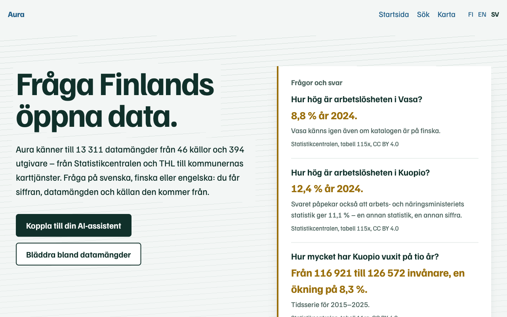
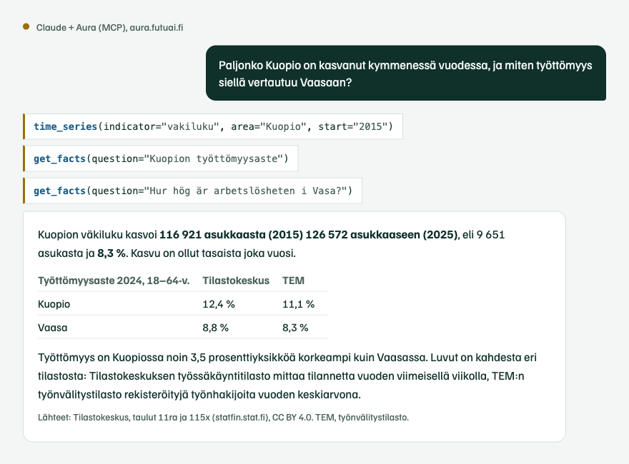
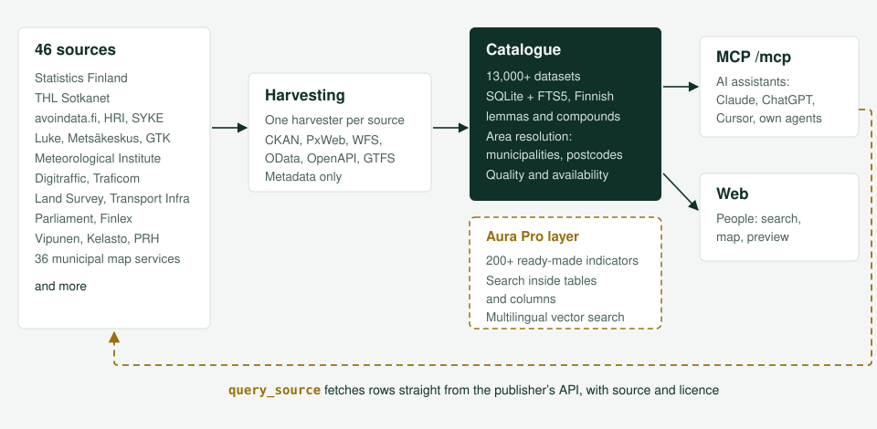

# Aura

**Fråga Finlands öppna data.** Aura samlar Finlands öppna data i en katalog och hämtar svaren direkt från utgivarens gränssnitt, med källa och licens. Använd den i webbläsaren eller koppla den till din AI-assistent.

[Suomi](README.md) | [English](README.en.md) | **Svenska**



> **13 300+ datamängder, 32 000+ resurser, 46 källor, cirka 400 utgivare.**
> Statistikcentralen, Institutet för hälsa och välfärd (THL), Naturresursinstitutet (Luke), Finlands miljöcentral (SYKE), Meteorologiska institutet, Digitraffic, Lantmäteriverket, riksdagen, Finlex, Patent- och registerstyrelsen, karttjänster i 36 kommuner och dussintals andra.

## Prova på en minut

Den offentliga tjänsten på **[aura.futuai.fi](https://aura.futuai.fi)** kräver varken konto eller installation. I Claude Code:

```bash
claude mcp add --transport http aura https://aura.futuai.fi/mcp
```

I Claude Desktop, Cursor och andra MCP-klienter:

```json
{
  "mcpServers": {
    "aura": { "type": "http", "url": "https://aura.futuai.fi/mcp" }
  }
}
```

Fråga sedan din assistent på svenska, finska eller engelska. Klientspecifika instruktioner finns i [installationsguiden](docs/MCP_SETUP.md) (på finska).

## Vad du kan fråga

Svaren nedan hämtades från Aura den 8 oktober 2026. Siffrorna är exakt som källan publicerat dem.

| Fråga | Aura svarar | Källa |
|---|---|---|
| Hur hög är arbetslösheten i Vasa? | 8,8 % år 2024. Vasa känns igen även om katalogen är på finska. | Statistikcentralen 115x |
| Hur hög är arbetslösheten i Kuopio? | 12,4 % år 2024, och en anmärkning om att arbets- och näringsministeriets statistik ger 11,1 % eftersom den mäter något annat. | Statistikcentralen 115x |
| Hur mycket har Kuopio vuxit på tio år? | 116 921 → 126 572 invånare (2015–2025), +8,3 % | Statistikcentralen 11ra |
| De sex största städerna efter folkmängd | Helsingfors 694 392, Esbo 325 716, Tammerfors 263 337, Vanda 252 956, Uleåborg 217 469, Åbo 209 633 (2025) | Statistikcentralen 11ra |
| air quality Helsinki | Meteorologiska institutets ENFUSER-prognos för luftkvalitet och HRM:s luftkvalitetsindex per timme | FMI, HRI |
| Var finns statistik om djurskyddsbrott? | Tabell 126q om djurhållningsförbud. Ordet finns inte i rubriken utan bland tabellens klassificeringsvärden. ¹ | Statistikcentralen |

¹ Sökning inne i datamängderna finns i [Aura Pro](#aura-pro).

Så här ser det ut i Claude (på finska). Assistenten gör tre anrop och berättar var siffrorna kommer ifrån och varför två statistiker ger olika resultat:



## För AI-agenter

Aura är byggd för agenter, inte bara för att bläddra.

Den publika profilen har fem verktyg på avsiktsnivå, och agenten arbetar med dem som en informationsspecialist: `find_data` söker, `inspect_dataset` förklarar vad datamängden innehåller och `query_source` hämtar raderna från källan. `area_snapshot` identifierar ett område och `find_related` hittar liknande datamängder.

Varje svar är strukturerat och följer ett publicerat `outputSchema`, så agenten behöver aldrig tolka fritext. Siffrorna kommer med källa, frågans exakta URL, licens och hämtningstid (`provenance`). Svaren föreslår nästa anrop (`next_actions`), och fel har en kod, en ledtråd och ett korrigerat anrop (`error.hint`, `error.suggested_call`).

Områden kan anges på många sätt: `Vasa`, `Vaasa`, `905`, `KU905`, `Österbotten`, `65100`. En nedlagd kommun tolkas som sin efterträdare.

`query_source` hanterar PxWeb, WFS, Meteorologiska institutets lagrade frågor, OData, CSV och JSON.

Instruktionerna är under 1 500 tecken, så Aura tar inte upp agentens kontext. En maskinläsbar beskrivning finns på [`/llms.txt`](https://aura.futuai.fi/llms.txt).

## För människor

Samma katalog finns i webbläsaren: sökning med filter, sidor för datamängder med resurser, förhandsvisning av tabeller och kartlager samt en karta över datamängderna per område. Bläddringssidorna är på finska; [startsidan](https://aura.futuai.fi/sv) finns även på svenska och engelska.

Aura hjälper också utgivare. Kvalitetsprofilen (`/mcp/laatu`) visar vilka av utgivarens datamängder som saknar beskrivning, nyckelord, uppdateringsfrekvens eller licens, och vilka länkar som inte fungerar.

## Var data kommer ifrån



Aura samlar in metadata, inte själva datan. Varje källa har en egen insamlare (CKAN, PxWeb, WFS, OData, OpenAPI, GTFS eller källans eget gränssnitt). När agenten behöver rader hämtar `query_source` dem direkt från utgivaren, så siffrorna är alltid lika färska som källan.

Fullständiga förteckningar: [datamängdskatalog](docs/CATALOG.md) och [källor](docs/SOURCES.md) (på finska).

## Aura Pro

[aura.futuai.fi](https://aura.futuai.fi) kör en vidareutvecklad version av Aura. Den kopplas på samma sätt som den öppna versionen och har dessutom:

- Färdiga nyckeltal: över 200 nyckeltal för kommuner, landskap och välfärdsområden med ett anrop, till exempel folkmängd, arbetslöshetsgrad, bostadspriser och sjuklighetsindex. Verktygen `get_facts`, `time_series` och `compare_areas`.
- Sökning inne i datamängderna: indexet omfattar statistiktabellernas klassificeringsvärden, kolumnnamn i geodata och begrepp i kodlistor, så ett ord hittas även när ingen rubrik innehåller det.
- Fråga på vilket språk som helst: vektorsökning kopplar engelska och svenska frågor till den finskspråkiga katalogen.
- Ärliga siffror: när två statistiker mäter samma sak på olika sätt anger svaret båda och förklarar skillnaden.

Tjänsten drivs av Futuai Oy. Pro-lagrets kod finns inte i detta repository. Allt i detta repository är MIT-licensierat och fungerar självständigt.

## Samma teknik för egen data

Aura är inte bunden till öppna data. Samma struktur fungerar för en organisations egna databaser, gränssnitt och geodatatjänster: en insamlare per källa, en metadatakatalog, sökning som förstår finska och MCP-verktyg som anger källan till varje siffra. Då hittar AI-assistenten organisationens egna data på samma sätt som den nu hittar en tabell från Statistikcentralen.

Det finns insamlare för CKAN, PxWeb, WFS, WMS, ArcGIS, OData, OpenAPI och GTFS, och en ny källa är oftast en fil ([instruktioner](CONTRIBUTING.md), på finska). Koden är MIT-licensierad, och frågor och idéer är välkomna [på GitHub](https://github.com/trotor/aura/issues).

## Kör den själv

Databasen följer med repositoryt ([Git LFS](https://git-lfs.github.com/)), så datamängderna finns direkt efter kloning.

```bash
git clone https://github.com/trotor/aura.git
cd aura
python3 -m venv .venv && source .venv/bin/activate
pip install -e .

claude              # Claude Code startar Aura från repositoryts .mcp.json
aura serve --http   # eller MCP + webb på http://127.0.0.1:8000
```

Mer om klienter, kommandoraden och verktygsprofiler finns i den [tekniska referensen](docs/REFERENCE.md) (på finska).

## Bidra

- Berika datamängder: när en agent undersöker en datamängd kan den spara vad den lärt sig (`enrich`, `save_session_findings`).
- Lägg till en källa: se [CONTRIBUTING.md](CONTRIBUTING.md).
- Berätta vad som saknas: [öppna ett ärende](https://github.com/trotor/aura/issues).

*Aura* betyder plog på finska: den vänder upp det som ligger dolt under ytan. Det är också en ljusring som gör synligt det som annars förblir i mörker.

## Upphovsperson

Aura är byggd av Tero Rönkkö ([tero@futuai.fi](mailto:tero@futuai.fi)). Projektet möjliggörs av [Futuai Oy](https://aura.futuai.fi), som tillhandahåller och underhåller den offentliga tjänsten så att vem som helst kan koppla Aura till sin assistent utan egen installation.

## Licens

[MIT](LICENSE). Datamängdernas licenser tillhör utgivarna, och Aura anger dem med varje svar.
